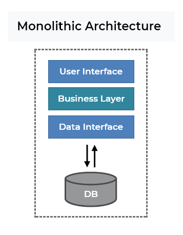
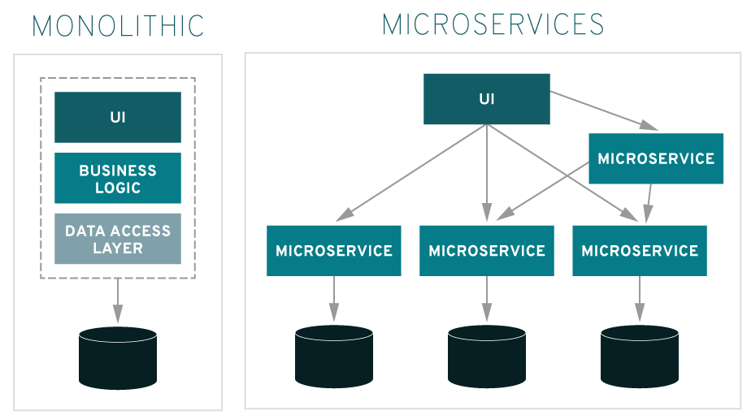

خب بریم برای یادگیری rabbitMQ
در واقع RabbitMQ یک message broker است . میتونیم بهش مثل یک اداره پست نگاه کنیم . این تکنولوژي پیام ها رو میپذیرد و ارسال میکند .
تو اداره پست وقتی نامه ای رو میخواهید ارسال کنید در صندوق پستی قرار میدید در نهایت هم میتونید مطم‍‍ئن باشید که نامه شما به مقصد خواهد رسید . نه دقیقا الان....

خب rabbitmq تا حد زیادی شبیه به یک اداره پست است اما تفاوت عمده ای با اون دارد .
در اداره پست ما با کاغذ سر و کار داریم اما در rabbitmq ما با داده های باینری سر و کار داریم.

## میکروسرویس چیست ؟
قبل از آشنایی بیشتر با rabbitmq خوب است با مفاهیمی نظیر میکروسرویس آشنا بشیم ... :)
در حال حاضر برنامه هایی که میسازیم دو تا معماری دارند .(در حالت کلی وگرنه معماری های دیگه هم داریم)
یکی معماری monolithic و دیگری microservice

همونطور که احتمالا حدس زدید معماری  monolithic که بهش MVC هم میگیم کل برنامه داخل یک جا هستش و از یک دیتا بیس هم استفاده میکنند .

همانطور که در تصویر بالا مشاهده میکنید کل برنامه در یکجا قرار دارد و از یک دیتا بیس هم استفاده میکنیم.

خب همانطور که احتمالا حدس زدید این معماری مشکلاتی دارد . مثلا اگر یک مشکلی پیش بیاد رفع اون مشکل دشوار خواهد بود . از طرفی اگر بخواهیم فیچری به پروژه اضافه کنیم حتی اگر هم کوچیک باشه نیازمند کلی تست خواهد بود که به مشکل نخوریم.

اما در معماری microservice برنامه به اجزای کوچکتری تقسیم میشه که بخش های مختلف هم با هم دیگر در ارتباط هستند.
در واقع در این معماری برنامه رو تکه تکه میکنیم و از هم کاملا جدا میکنیم و در نهایت توسط بروکر ها به هم متصل میکنیم . (نگران هیچی نباشید جلوتر میبینیم یعنی چی )

